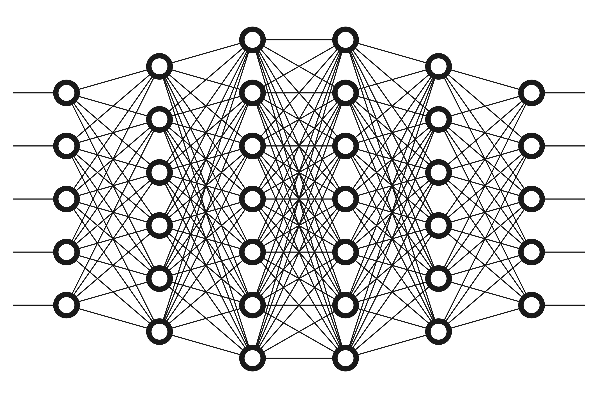
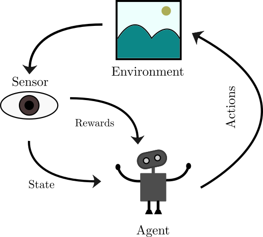
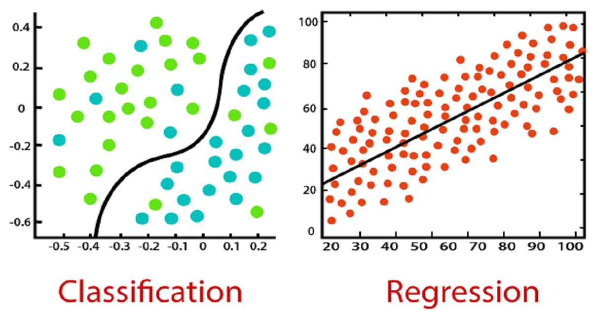
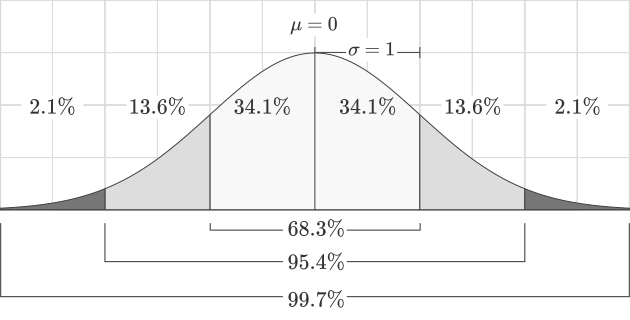
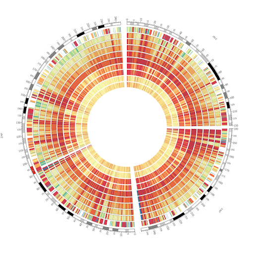

# datascience

***under construction***

here I share my codes and notebooks from the courses that I have taken or the projects that I have worked on.

## Index

* [Deep learning](#deep-learning)
* [Reinforcemnet learning](#reinfrocement-learning)
* [Machine learning](#machine-learning)
* [Big Data](#big-data)
* [Statistics and Inference](#statistics-and-infernce)
* [Data visualization](#data-visualization)

## Deep learning

 

  

here I share deep learning codes

|code|describtion|language|libraries|
|----|-----------|--------|---------|
|[pytorch_functions.ipynb](https://github.com/YoTaSo/datascience/blob/main/deeplearning/pytorch_functions.ipynb)|Definition of functions in pyTorch| | |
|[pytorch_autograd.ipynb](https://github.com/YoTaSo/datascience/blob/main/deeplearning/pytorch_autograd.ipynb)|PyTorch autograd and modules| ||
|[pytorch_autoencoder.ipynb](https://github.com/YoTaSo/datascience/blob/main/deeplearning/pytorch_autoencoder.ipynb)|Implementation of Autoencoder on MNIST dataset, Data management, Checkpointing and GPU| ||
|[highway_network.ipynb](https://github.com/YoTaSo/datascience/blob/main/deeplearning/highway_network.ipynb)|Implementation of [Highway networks](https://arxiv.org/pdf/1505.00387.pdf)| ||
|[rnn_classification.ipynb](https://github.com/YoTaSo/datascience/blob/main/deeplearning/rnn_classification.ipynb)|Recurrent neural networks, sequence classification, [temperature data](https://github.com/YoTaSo/datascience/blob/main/deeplearning/temprature_30.csv)| ||
|[rnn_prediction.ipynb](https://github.com/YoTaSo/datascience/blob/main/deeplearning/rnn_prediction.ipynb)|Recurrent neural networks, sequence prediction, multi-variate time series prediction with and without taking into account the correlation on temperature dataset| ||
|[rnn_generation.ipynb](https://github.com/YoTaSo/datascience/blob/main/deeplearning/rnn_generation.ipynb)|Recurrent neural networks, sequence generation, generating speech trained on trump's speech [dataset](https://github.com/YoTaSo/datascience/blob/main/deeplearning/trump_full_speech.txt)| ||
|[cnn_classification.ipynb](https://github.com/YoTaSo/datascience/blob/main/deeplearning/cnn_classification.ipynb)|Convolutional neural Networks, Sentiment analysis, uses subword units, highlites sub-sequents of the input which activates the output more, cnn classifiaction task| |, **SentencePiece**|
|[lstm_gru_generation.ipynb](https://github.com/YoTaSo/datascience/blob/main/deeplearning/lstm_gru_generation.ipynb)|*LSTM* and *GRU*, Sequence generation on Trump's speech data set, uses subword units, compares LSTM and GRU and RNN| |, **SentencePiece**|

## Reinfrocement learning
 

  

here I share reinforcement learning codes

|code|describtion|environment|language|libraries|
|----|-----------|--------|---------|---------|
|[policy_value_iteration.ipynb](https://github.com/YoTaSo/datascience/blob/main/rl/policy_value_iteration.ipynb)|Policy iteration and Value iteration algorithmes on Grid world environment|| |,  |
|[qlearning.ipynb](https://github.com/YoTaSo/datascience/blob/main/rl/qlearning.ipynb)|Qlearning algorithm, including versions basic, *SARSA*, *Dyna-Q*. gridworld environment| |,  |

## Big data
 

  

here I share big data codes

|code|describtion|language|libraries|
|----|-----------|--------|---------|
|hello.py|a code to bla bla| |sklearn, numpy|
|hello.py|a code to bla bla| |sklearn, numpy|

## Machine learning

 

  

here I share ML codes

|code|describtion|language|libraries|
|----|-----------|--------|---------|
|hello.py|a code to bla bla| |sklearn, numpy|
|hello.py|a code to bla bla| |sklearn, numpy|

## Statistics/Inference

 

  

here I share Statistics codes

|code|describtion|language|libraries|
|----|-----------|--------|---------|
|hello.py|a code to bla bla| |sklearn, numpy|
|hello.py|a code to bla bla| |sklearn, numpy|

## Data visualization
 

  

here I share visuzalization code

|code|describtion|language|libraries|
|----|-----------|--------|---------|
|hello.py|a code to bla bla| |sklearn, numpy|
|hello.py|a code to bla bla| |sklearn, numpy|
